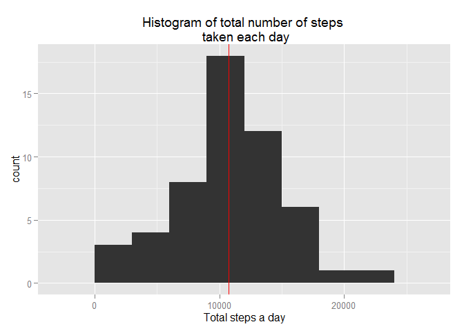
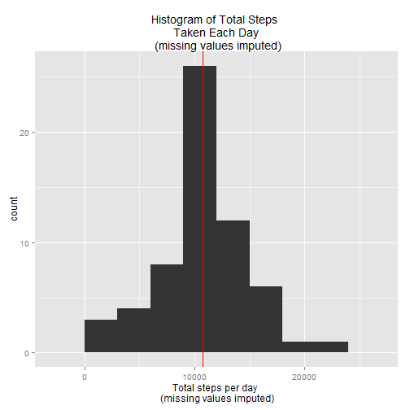
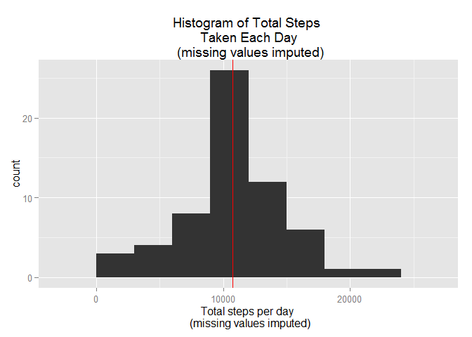
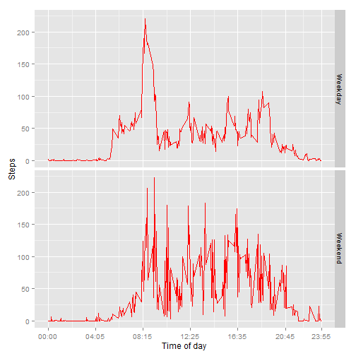

# Reproducible Research Assignment 1
Dataset used for this analysis can be [downloaded](https://d396qusza40orc.cloudfront.net/repdata%2Fdata%2Factivity.zip) from the website of Coursera's course Reproducible Research. It consists of 17568 observations and 3 variables. All observations are number of steps of one single individual recorded in 5-minute intervals throughout the whole 24 hours. Steps were recorded during the months of October and November.   

##Loading and preprocessing the data    

```r
library(knitr)
opts_chunk$set(echo = TRUE,  message = FALSE, cache = TRUE, cache.path = "cache/", fig.path = "figure/")   


Sys.setlocale("LC_ALL", "C")
```

```
## [1] "C"
```

```r
unzip("activity.zip", files = NULL, list = FALSE, overwrite = TRUE, junkpaths = FALSE, exdir = ".", unzip = "internal", setTimes = FALSE)
activity <- read.csv("activity.csv", stringsAsFactors = FALSE)

str(activity)
```

```
## 'data.frame':	17568 obs. of  3 variables:
##  $ steps   : int  NA NA NA NA NA NA NA NA NA NA ...
##  $ date    : chr  "2012-10-01" "2012-10-01" "2012-10-01" "2012-10-01" ...
##  $ interval: int  0 5 10 15 20 25 30 35 40 45 ...
```

```r
activity.cleaned <- activity
```
The dataset contains 3 variables: steps, date and interval. We can turn variable **date** into a variable of date format. The **interval** variable contains 5 minute intervals, so to turn it properly into date and time format it is important to notice that interval 55 is followed by 100, marking a full hour(1:00) and not 100 minutes, as one might falsly conclude. If we take that as 100 minutes we would have a gap of 40 minutes which isn't the case: the intervals were noted consecutively and if a measurement lacked data this was noted as NA in the variable **steps**.   

```r
split.intervals <- as.character(activity.cleaned$interval)
split.intervals <- strsplit(split.intervals, "")
#this function should put intervals into propper hh:mm format, so to avoid a gap of 40 minutes that would occur if we let 100 be read as 100 minutes instead of 01:00 hour which is correct way:
set.time <- function(split.intervals){
  container <- vector(length = length(split.intervals))
  ##function that takes intervals and turns them into hh:mm format
  for (i in 1:length(split.intervals)){
    if (length(split.intervals[[i]]) == 1){
      x = paste("00:0", split.intervals[[i]], sep = "")
    }
      
    if (length(split.intervals[[i]]) == 2){
      x = paste("00", paste(split.intervals[[i]][1], split.intervals[[i]][2], sep = ""), sep = ":")
    }
    
    if (length(split.intervals[[i]]) == 3){
      x = paste("0", paste(split.intervals[[i]][1], paste(split.intervals[[i]][2], split.intervals[[i]][3], sep = ""), sep = ":"), sep = "")
    } 
    
    if (length(split.intervals[[i]]) == 4){
      x = paste(paste(split.intervals[[i]][1], split.intervals[[i]][2], sep = ""),
                paste(split.intervals[[i]][3], split.intervals[[i]][4], sep = ""),
                sep = ":")
    }
    container[i] <- x
  }
  container
}
time <- set.time(split.intervals)
datetime <- paste(activity.cleaned$date, time, sep = " ")
```


The original dataset is preserved as is, and changes are contained in the dataset named `activity.cleaned`

```r
library(lubridate)

activity.cleaned$date <- ymd(activity.cleaned$date)
str(activity.cleaned$date)
```

```
##  POSIXct[1:17568], format: "2012-10-01" "2012-10-01" "2012-10-01" "2012-10-01" ...
```

```r
activity.cleaned$date.min <-ymd_hm(datetime) 
activity.cleaned$time <- time

head(activity.cleaned)
```

```
##   steps       date interval            date.min  time
## 1    NA 2012-10-01        0 2012-10-01 00:00:00 00:00
## 2    NA 2012-10-01        5 2012-10-01 00:05:00 00:05
## 3    NA 2012-10-01       10 2012-10-01 00:10:00 00:10
## 4    NA 2012-10-01       15 2012-10-01 00:15:00 00:15
## 5    NA 2012-10-01       20 2012-10-01 00:20:00 00:20
## 6    NA 2012-10-01       25 2012-10-01 00:25:00 00:25
```

```r
str(activity.cleaned)
```

```
## 'data.frame':	17568 obs. of  5 variables:
##  $ steps   : int  NA NA NA NA NA NA NA NA NA NA ...
##  $ date    : POSIXct, format: "2012-10-01" "2012-10-01" ...
##  $ interval: int  0 5 10 15 20 25 30 35 40 45 ...
##  $ date.min: POSIXct, format: "2012-10-01 00:00:00" "2012-10-01 00:05:00" ...
##  $ time    : chr  "00:00" "00:05" "00:10" "00:15" ...
```
     
     
##What is mean total number of steps taken per day?   
To find out total number of steps taken per day first we need to sum all the steps measured at intervals within a day, and then calculate the mean and median of total number of steps across all the days that we have data for:

```r
#summing all the steps within each day
(total.steps <- with(activity.cleaned, tapply(steps, date, sum)))
```

```
## 2012-10-01 2012-10-02 2012-10-03 2012-10-04 2012-10-05 2012-10-06 
##         NA        126      11352      12116      13294      15420 
## 2012-10-07 2012-10-08 2012-10-09 2012-10-10 2012-10-11 2012-10-12 
##      11015         NA      12811       9900      10304      17382 
## 2012-10-13 2012-10-14 2012-10-15 2012-10-16 2012-10-17 2012-10-18 
##      12426      15098      10139      15084      13452      10056 
## 2012-10-19 2012-10-20 2012-10-21 2012-10-22 2012-10-23 2012-10-24 
##      11829      10395       8821      13460       8918       8355 
## 2012-10-25 2012-10-26 2012-10-27 2012-10-28 2012-10-29 2012-10-30 
##       2492       6778      10119      11458       5018       9819 
## 2012-10-31 2012-11-01 2012-11-02 2012-11-03 2012-11-04 2012-11-05 
##      15414         NA      10600      10571         NA      10439 
## 2012-11-06 2012-11-07 2012-11-08 2012-11-09 2012-11-10 2012-11-11 
##       8334      12883       3219         NA         NA      12608 
## 2012-11-12 2012-11-13 2012-11-14 2012-11-15 2012-11-16 2012-11-17 
##      10765       7336         NA         41       5441      14339 
## 2012-11-18 2012-11-19 2012-11-20 2012-11-21 2012-11-22 2012-11-23 
##      15110       8841       4472      12787      20427      21194 
## 2012-11-24 2012-11-25 2012-11-26 2012-11-27 2012-11-28 2012-11-29 
##      14478      11834      11162      13646      10183       7047 
## 2012-11-30 
##         NA
```

```r
str(total.steps)
```

```
##  int [1:61(1d)] NA 126 11352 12116 13294 15420 11015 NA 12811 9900 ...
##  - attr(*, "dimnames")=List of 1
##   ..$ : chr [1:61] "2012-10-01" "2012-10-02" "2012-10-03" "2012-10-04" ...
```

```r
(mean.total.steps <- mean(total.steps, na.rm = TRUE))
```

```
## [1] 10766.19
```

```r
(median.total.steps <- median(total.steps,na.rm = TRUE))
```

```
## [1] 10765
```
I have decided to not remove NA observations when calculating sum, hence the days where there are missing observations will have NA as a number of total steps taken that day. In case I have decided to remove NA's when calculating sum I would have 0 steps for days with missing observation. That would mean that we accepted that participant made 0 steps that particular day with missing observation day which is not realistic. However, when calculating mean and median of to avoid having NA as mean and median NA's have to be removed by adding `na.rm = TRUE` argument to the function.    
The mean number of steps per day is 10766.19, while median number of steps per day is 10765.

```r
library(ggplot2)
h <- qplot(total.steps, binwidth = 3000, main = "Histogram of total number of steps \n taken each day", xlab = "Total steps a day")
h + geom_vline(xintercept = mean.total.steps, color = "red")
```

 

```r
summary(total.steps)
```

```
##    Min. 1st Qu.  Median    Mean 3rd Qu.    Max.    NA's 
##      41    8841   10760   10770   13290   21190       8
```

##What is the average daily activity pattern?  
To make a time series plot of the 5-minute intervals and average number of steps per interval across all days in the dataset, we need to first calculate average number of steps per interval across all days:

```r
ts <- with(activity.cleaned, tapply(steps, time, mean, na.rm = TRUE))
head(ts,30)
```

```
##     00:00     00:05     00:10     00:15     00:20     00:25     00:30 
## 1.7169811 0.3396226 0.1320755 0.1509434 0.0754717 2.0943396 0.5283019 
##     00:35     00:40     00:45     00:50     00:55     01:00     01:05 
## 0.8679245 0.0000000 1.4716981 0.3018868 0.1320755 0.3207547 0.6792453 
##     01:10     01:15     01:20     01:25     01:30     01:35     01:40 
## 0.1509434 0.3396226 0.0000000 1.1132075 1.8301887 0.1698113 0.1698113 
##     01:45     01:50     01:55     02:00     02:05     02:10     02:15 
## 0.3773585 0.2641509 0.0000000 0.0000000 0.0000000 1.1320755 0.0000000 
##     02:20     02:25 
## 0.0000000 0.1320755
```

```r
intervals1 <- names(ts)
tsch <- ts  #we'll need this later

(indmax <- which.max(ts)) #index of observation
```

```
## 08:35 
##   104
```

```r
(ts[indmax])  #value of actual maximal observation
```

```
##    08:35 
## 206.1698
```
The maximum number of steps are found in the interval that matches 8:35 am and is approximately 206 steps.   

```r
df.mean.intervals <- data.frame(means = as.numeric(as.character(ts)), intervals1 = intervals1)
ggplot(data = df.mean.intervals, aes(x = seq_along(intervals1), y = means))  +
    geom_line(color = "red") +
    labs(x = "Time of day", y = "Steps", title = "Average Activity \n Throughout the Day")  +
    geom_vline(xintercept = seq_along(intervals1)[104], color = "green")  +
    scale_x_continuous(breaks = c(1,50, 104, 150, 200, 250, 288), label = intervals1[c(1,50, 104, 150, 200, 250, 288)])
```

 

From the plot of daily activity we can see that activity is very low during first about five hours and late in the evening, few hours before midnight. This is expected because people usually sleep during that time. The peak happens at 8:35, with 206 steps on average. This is usually the time when people hurry to get to work: the frequency of steps per interval increases.       

##Imputing missing values    
There are 2304 missing values in this dataset. 

```r
#number of missing values in dataset:
(numberNA <- sum(is.na(activity.cleaned$steps)))
```

```
## [1] 2304
```

```r
#imputing mean values:
indx.na <- which(is.na(activity.cleaned$steps))
zzz <- activity.cleaned$steps
zzz[indx.na] <- ts[paste(activity.cleaned$time[indx.na], "", sep = "")]
head(zzz, 10)
```

```
##  [1] 1.7169811 0.3396226 0.1320755 0.1509434 0.0754717 2.0943396 0.5283019
##  [8] 0.8679245 0.0000000 1.4716981
```

```r
head(tsch, 10)
```

```
##     00:00     00:05     00:10     00:15     00:20     00:25     00:30 
## 1.7169811 0.3396226 0.1320755 0.1509434 0.0754717 2.0943396 0.5283019 
##     00:35     00:40     00:45 
## 0.8679245 0.0000000 1.4716981
```

```r
#adding column with imputed steps to the dataset ( missing value filled)

activity.cleaned$imputed.steps <- zzz 

#calculating mean number of steps per interval with imputed  data
(total.steps.imp <- with(activity.cleaned, tapply(imputed.steps, date, sum)))
```

```
## 2012-10-01 2012-10-02 2012-10-03 2012-10-04 2012-10-05 2012-10-06 
##   10766.19     126.00   11352.00   12116.00   13294.00   15420.00 
## 2012-10-07 2012-10-08 2012-10-09 2012-10-10 2012-10-11 2012-10-12 
##   11015.00   10766.19   12811.00    9900.00   10304.00   17382.00 
## 2012-10-13 2012-10-14 2012-10-15 2012-10-16 2012-10-17 2012-10-18 
##   12426.00   15098.00   10139.00   15084.00   13452.00   10056.00 
## 2012-10-19 2012-10-20 2012-10-21 2012-10-22 2012-10-23 2012-10-24 
##   11829.00   10395.00    8821.00   13460.00    8918.00    8355.00 
## 2012-10-25 2012-10-26 2012-10-27 2012-10-28 2012-10-29 2012-10-30 
##    2492.00    6778.00   10119.00   11458.00    5018.00    9819.00 
## 2012-10-31 2012-11-01 2012-11-02 2012-11-03 2012-11-04 2012-11-05 
##   15414.00   10766.19   10600.00   10571.00   10766.19   10439.00 
## 2012-11-06 2012-11-07 2012-11-08 2012-11-09 2012-11-10 2012-11-11 
##    8334.00   12883.00    3219.00   10766.19   10766.19   12608.00 
## 2012-11-12 2012-11-13 2012-11-14 2012-11-15 2012-11-16 2012-11-17 
##   10765.00    7336.00   10766.19      41.00    5441.00   14339.00 
## 2012-11-18 2012-11-19 2012-11-20 2012-11-21 2012-11-22 2012-11-23 
##   15110.00    8841.00    4472.00   12787.00   20427.00   21194.00 
## 2012-11-24 2012-11-25 2012-11-26 2012-11-27 2012-11-28 2012-11-29 
##   14478.00   11834.00   11162.00   13646.00   10183.00    7047.00 
## 2012-11-30 
##   10766.19
```

```r
qplot(total.steps.imp, binwidth = 3000, main = "Histogram of Total Steps \n Taken Each Day \n (missing values imputed)", xlab = "Total steps per day \n (missing values imputed)")   +
  geom_vline(xintercept = mean(total.steps.imp), color = "red")
```

 

```r
(mean.total.steps.imp <- mean(total.steps.imp))
```

```
## [1] 10766.19
```

```r
mean.total.steps.imp != mean.total.steps
```

```
## [1] FALSE
```

```r
(median.total.steps.imp <- median(total.steps.imp))
```

```
## [1] 10766.19
```

When we impute mean number of steps per interval in places with missing values the mean number of steps per day(10766.19) is the same as the mean number of steps calculated by ignoring mising data (10766.19). The median with missing data(10765) is slightly smaller than the median with imputed data(10766.19).      
  
##Are there differences in activity patterns between weekdays and weekends?   
It might be reasonable to expect that daily activity pattern differs between weekdays and weekends. To explore that, we might draw a plot that shows daily activity pattern separately for wekdays and weekends.

```r
y <- weekdays(activity.cleaned$date)
activity.cleaned$day <- ifelse(y == c("Saturday", "Sunday"), "Weekend", "Weekday")
head(activity.cleaned$day)
```

```
## [1] "Weekday" "Weekday" "Weekday" "Weekday" "Weekday" "Weekday"
```

```r
ts.weekday <- with(activity.cleaned[activity.cleaned$day == "Weekday", ], tapply(imputed.steps, time, mean))
ts.weekend <- with(activity.cleaned[activity.cleaned$day == "Weekend", ], tapply(imputed.steps, time, mean))
df <- data.frame(mean.val = ts.weekday,  time = names(ts.weekday), day = "Weekday", dt = activity.cleaned$date.min[1:288])
head(df)            
```

```
##         mean.val  time     day                  dt
## 00:00 1.94375222 00:00 Weekday 2012-10-01 00:00:00
## 00:05 0.38447846 00:05 Weekday 2012-10-01 00:05:00
## 00:10 0.14951940 00:10 Weekday 2012-10-01 00:10:00
## 00:15 0.17087932 00:15 Weekday 2012-10-01 00:15:00
## 00:20 0.08543966 00:20 Weekday 2012-10-01 00:20:00
## 00:25 1.38981844 00:25 Weekday 2012-10-01 00:25:00
```

```r
df2 <- data.frame(mean.val = ts.weekend, time = names(ts.weekday), day = "Weekend", dt = activity.cleaned$date.min[1:288])
head(df2)
```

```
##          mean.val  time     day                  dt
## 00:00 0.214622642 00:00 Weekend 2012-10-01 00:00:00
## 00:05 0.042452830 00:05 Weekend 2012-10-01 00:05:00
## 00:10 0.016509434 00:10 Weekend 2012-10-01 00:10:00
## 00:15 0.018867925 00:15 Weekend 2012-10-01 00:15:00
## 00:20 0.009433962 00:20 Weekend 2012-10-01 00:20:00
## 00:25 6.761792453 00:25 Weekend 2012-10-01 00:25:00
```

```r
df.mean <- rbind(df, df2)
dim(df.mean)
```

```
## [1] 576   4
```

```r
names(df.mean)
```

```
## [1] "mean.val" "time"     "day"      "dt"
```

```r
df.mean$mean.val <- as.numeric(as.character(df.mean$mean.val))

ggplot(data = df.mean, aes(x = df.mean$dt, y = mean.val))  +
  geom_line(color = "red") +
  labs(y = "Steps", x = "Time of day")  +
  facet_grid(day ~ .)  +
  scale_x_datetime(breaks = df.mean$dt[c(1,50, 100, 150, 200, 250, 288)],labels = time[c(1,50,100,150,200,250,288)])
```

 

I would describe the difference between these two plots as following: On weekdays people usually get up earlier than on weekdays, but the peak is about the same time. However, important difference is that during the rest of the day our observed individual walks more on weekends than on weekdays. Could it be because the participant has job that is mostly sedentary, and on weekends perhaps tries to be more physically active, runs errands, spends time with kids doing some physical activity?      
